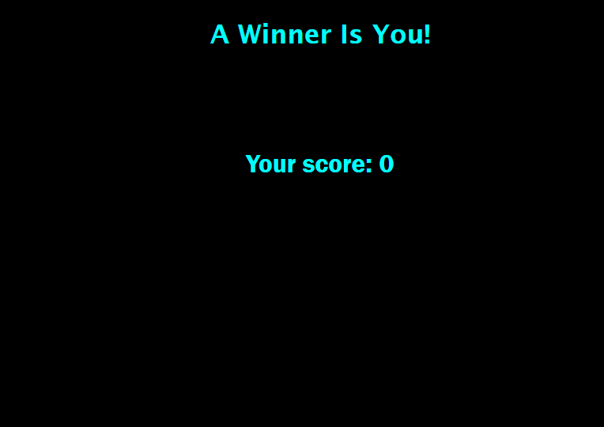

# Code Quiz

## Table of Contents

- [Description](#description)
- [Visuals](#visuals)
- [Resources](#resources)

## Description

Code quiz that tests your knowledge of basic JavaScript information. Makes use of event listeners, a timer, and local storage to display a score at the end of the quiz.

## Visuals

### Quiz upon app launch

### Quiz score screen

## Resources

[Live Site](https://bureizu742.github.io/code-quiz/)

[Repository](https://github.com/Bureizu742/code-quiz)